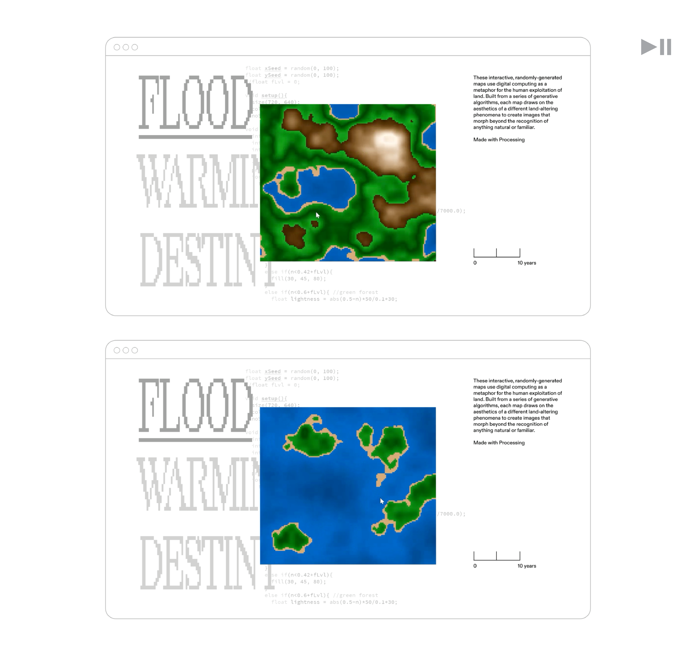
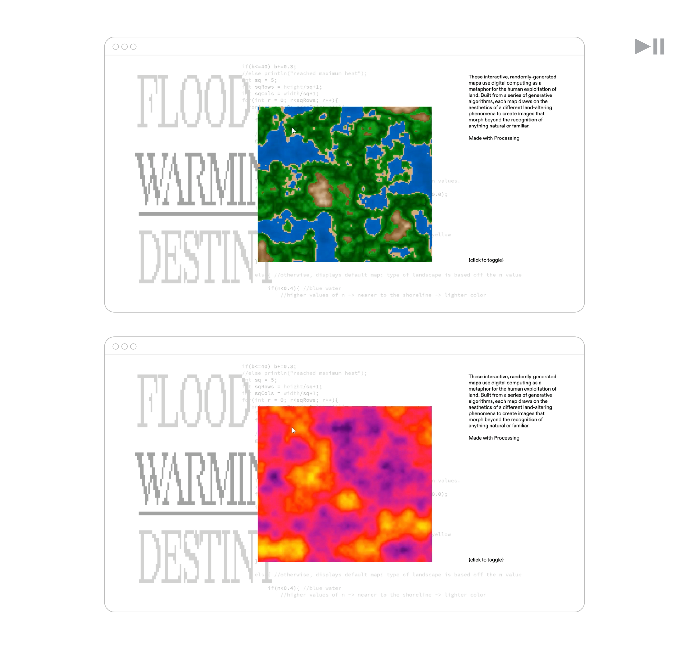
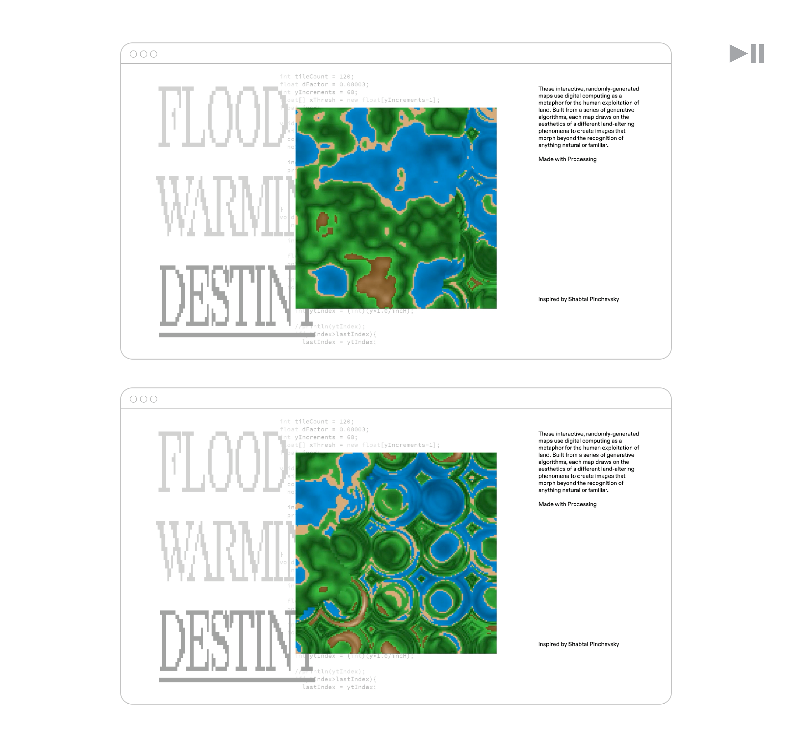

# Generative Map Graphics
A collection of sketches that produce variations on a basic landscape map written with the Processing graphics library (Java).

These interactive, simulation maps create digital visualizations of the human exploitation of land. Built from Perlin noise maps, each graphic draws on the aesthetics of a different land-altering phenomena to create images that morph beyond the recognition of anything natural.

## Main Skteches
<!--

 
-->

https://github.com/user-attachments/assets/f33cf193-2b22-4013-b7b5-6ea6e67c5889

Video demonstration of three main sketches. Backdrop created in Adobe AfterEffects. 

### Sketch 1: FloodMap
The flood map explores the extremities of water, representing both the flood and drought catalyzed by climate change. By moving the position of the mouse, the user controls the habitat as it changes from  healthy to flooded to barren.
<!--  -->

### Sketch 2: HeatMap
The heat map explores the rate in which global temperatures rise. As the landscape changes over time, the user can click to toggle between a thermal overlay that turns rapidly warmer in color.
<!-- -->
<!--  -->

### Sketch 3: ManifestDestiny
This map explores the American idea of Manifest Destiny by portraying a westward moving distortion that imposes the landscape into a grid, distorting it until it is barely recognizable as land. This map is inspired by Shabtai Pinchevsky’s “The Jefferson Grid,” which documents unnaturally geometric squares of land as seen from Google Earth, a legacy from Thomas Jefferson’s 18th-century Public Land Survey System that divided America into square-mile parcels to distribute among American citizens.
<!-- -->

## How to Run
1. Download [Processing 4](https://processing.org/download).
2. Clone or download this repository.
3. Open any of the `.pde` files in the Processing IDE.
4. Press the **Play** button.
  a. To open the main sketches featured above, find 'Maps01', 'Maps02', etc.

Some folders also contain images (some stored in 'archive' folders) with examples of graphics produced by that program as I worked on it. 

## Project Background

I used creative coding in Processing to create visuals that evoke mountain, forest, sand, and water. In addition to standard problem solving, I relied on exploration and creativity. I went through multiple rounds between brainstorming how to create my desired graphics, and refining my code what effects would come out. It features:
- Seed generation and 3D noise argument (x, y, time) to create a smooth animation and map
- Data mapping:
  - 0 - 0.4: Ocean and lake
  - 0.4 - 0.6: Forest
  - 0.6 - 1: Mountain and snow
- Input from mouse position and clicks
- Over a dozen varations on different effects and distortions

The maps are heavily pixelated and change at the rate of years, decades, and millennia—these distinctly unnatural signifiers serve as reminders of the technology inherent in these depictions of nature. In their visual container, each map lies against a backdrop of its own code that juxtaposes the visuals with the algorithms that created them. The distorted pixel typeface similarly evokes the digital and its abstraction of nature into unrecognizable forms.

I was inspired to work on this project from the multitude of climate change maps online, and by my love for computer science as a tool to be used across art, science, and communication. 
